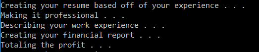

# Lab42FactoryMethodDesignPattern

## Summary
This is a sample of how a Factory Method design pattern works.  
While actual implementations of this design pattern may not have "Factory" explicitly in their class/name,  
all of them will have some sort of create functionality (hence its name of Factory Method).  

## Key Ideas  
1. Product -> an abstract class, represents a general concept of what is being created  
	- Pages

2. Concrete Product -> a concrete class, the physical product to be created  
	- Educational History  
	- Work History  
	- Accounts  
	- Sales  

3. Creator -> an abstract class, represents a general concept of what is creating the product  
	- Documents  

4. Concrete Creator -> a concrete class, represents the physical object that is creating the physical product  
	- Resume  
	- Financial Report  

## Example
Here is an example of our code creating a resume and financial report.  
The resume uses a page type of "experience" while the financial report uses a page type of "Products".  
  

## Directions
To play around with this example follow these steps:
1. Download Visual Studio  
2. Clone the repository: https://github.com/jimmychang94/Lab42FactoryMethodDesignPattern  
3. Open the file "FactoryMethodDesignPattern.sln" in Visual Studio
4. Edit the example however you desire.  
5. To test, go into the "Debug" menu and press the "Start Without Debugging" option.  

## Other information
This design pattern and many more are detailed [here](https://www.exceptionnotfound.net/introducing-the-daily-design-pattern/)  
Additional GitHub examples are also shown at the site linked above.  